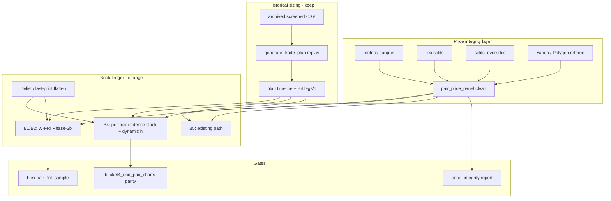

# Production Actual Backtest — Realism Plan

**Date:** 2026-07-13 (residual §8–§9 added 2026-07-14)  
**Status:** P0–P3 + F1/F2 + **§9 G1–G4 IMPLEMENTED** + **empty-B4-plan hold** (anti May-wipe glitch; G5 Flex seed optional)  
**Scope:** Make `scripts/production_actual_backtest.py` (notebook `prod` mode) mark and trade like live ops: clean prices, B4 TR/VCR cadence in the book ledger, honest delistings, and validation vs Flex.
**Artifacts already generated:**
- `notebooks/output/production_actual_bt/_price_integrity_suspects.csv` — **87 / 309** held ETFs flagged
- `notebooks/output/production_actual_bt/_price_integrity_all_etfs.csv` — full scan

---

## 0. Findings (why this plan exists)

### 0.1 False / stale prices are systemic

Scan = metrics `etf_adj_close` vs Yahoo close for every ETF that appears in `pair_daily_pnl.csv`.

Flag if any of: day return \|r\| > 50%, ≥5 days with \|metrics/Yahoo − 1\| > 15%, or max ratio gap > 0.8.

| Example | Worst day | Metrics jump | Yahoo that day | Issue |
|---------|-----------|--------------|----------------|-------|
| **RDWU** | 2026-04-21 | +218% (11.33→36.04) | +4% (11.33→11.79) | Corrupt metrics; −$24k phantom PnL |
| **COYY / MTYY / TSYY** | 2026-06-08 | residual after flex | (partially fixed by overrides) | Still high Yahoo mismatch count |
| **SNDU** | 2026-04-21 | large | (overrides exist) | Still flagged — verify residual |
| **INTW, DLLL, SMCL, MULL, …** | various | factors 2–20× | scale/split desync | Likely unadjusted or wrong adj |
| **VRTL, NVDL, MVLL, …** | Jun | many mismatch days | Yahoo scale ≠ metrics | Need source-of-truth policy |

Also: vendor und holes (CLSZ/CLSK mid-June) — Yahoo extend helps marking but is not a delisting model.

### 0.2 Why there is no TR/VCR cadence in notebook `prod` mode

The engine **exists** and is production code:

- `scripts/bucket4_hedge_cadence.py` — `h` + `interval_days` from TR/VCR  
- Used in GTP / opt2 (legs baked into plans), `frozen` mode `_b4_family_nav`, EOD charts, risk_sim  
- Live ops: GTP daily + rebalance ~every 5 bdays + `bucket4_cadence_gate.py` (see `scripts/BUCKET4_CADENCE_ROLLOUT.md`)

Notebook **`prod` deliberately does not use it for P&L**:

```
Plans sized every screened day (GTP embeds a snapshot of h/legs)
        ↓
simulate_book_from_plan_timeline
        ↓
One book ledger for B1/B2/B4/B5
        ↓
Retarget on weekly W-FRI (+ Phase-2b bands)
Share-hold between Fridays — no per-pair cadence clock
```

**Why it was built that way**
1. **One execution model** for all sleeves (B1/B2 are weekly W-FRI; B4 was forced onto the same clock).  
2. **Cadence already “in” the plan** as of each sizing day — but the book does not *re-apply* `build_rebal_dates` / dynamic `h` between Fridays.  
3. **Scope / speed** — full GTP replay already heavy; wiring per-pair cadence into the multi-sleeve ledger was deferred (`REPORT.md` limitation: “no daily OLS hedge rebuild”).

`frozen` mode *does* run `bucket4_dynamic_bt` + production cadence — but that is a one-day weight snapshot, not historical GTP sizing.

So: **sizing fidelity high, B4 hedge-path fidelity low** in the notebook you are looking at.

### 0.3 Other realism gaps (for a complete plan)

| Gap | Today |
|-----|--------|
| Delistings | Plan drop / stale mark / blacklist — no last-trade flatten or liquidation NAV |
| Ratchet floors | From prior *sim* plan, not Flex |
| Borrow | Spot `borrow_current` from screen, not history curve |
| Margin | Flat 4.45% Actual/360 |
| Locates / rejects | None |
| Costs | 20 bp slip + $0.0035/sh — no borrow spike days |
| etf-dashboard | Data sibling + generic JS pair BT — not production cadence |
| `b4_sizing_method.pdf` | Sizing stack only — not book NAV |

---

## 1. Goals / non-goals

### Goals
1. **Price integrity:** no phantom ±$10k+ days from corrupt metrics (RDWU-class).  
2. **B4 execution:** prod book uses same TR/VCR `h` + `interval_days` + cadence gate as live.  
3. **Delistings:** forced flatten at last real print (or distribution NAV when known).  
4. **Auditability:** integrity report + side-by-side vs Flex / EOD charts.  
5. **Notebook:** one “realistic” mode that is the default for Production_Actual_Backtest.

### Non-goals (v1)
- Tick-level microstructure / partial fills  
- Perfect borrow locate simulation  
- Replacing etf-dashboard JS explorer  
- Claiming identity with live PnL before Flex reconciliation gate passes  

---

## 2. Target architecture



---

## 3. Workstreams

### A — Price integrity (fix all stale / false prices)

**A1. Make the scan a first-class tool**  
- Promote the scan to `scripts/price_integrity_audit.py`  
- Inputs: run metrics + held universe (or all tickers)  
- Outputs: suspects CSV + markdown summary + optional PNG of worst divergences  
- CI / pre-backtest gate: fail or warn if any held name has \|r\| > 50% vs Yahoo referee on same day  

**A2. Source-of-truth policy (ordered)**  
For each symbol/day close used in the sim panel:  
1. Flex-adjusted metrics (current pipeline)  
2. `splits_overrides.csv`  
3. Residual heuristic (existing, whitelist factors)  
4. **Referee patch:** if \|metrics/Yahoo − 1\| > band (e.g. 15%) *and* und move does not corroborate, **replace ETF print with level-matched Yahoo** (same join logic as extend)  
5. Und: prefer metrics; fill holes with Yahoo; never invent und past delist  

Document band / corroboration rule so we do not overwrite real 2× days.

**A3. Bulk repair pass (immediate)**  
Priority by \|PnL impact\| ∩ suspects:  
- **P0:** RDWU (known phantom), any held name with single-day \|r\| > 100% vs Yahoo  
- **P1:** COYY/MTYY/TSYY residual check; SNDU/SNXX; INTW/DLLL/SMCL-class scale bugs  
- **P2:** Rest of 87 suspects — auto-patch via referee where clean; manual override rows where Yahoo also wrong  

Write durable fixes into `data/splits_overrides.csv` and/or new `data/price_patches.csv` (date, symbol, close, source, reason).

**A4. Stale / truncated series**  
- Keep Yahoo extend for und (and ETF when Yahoo has prints)  
- If ETF Yahoo dead but und live: beta-synthesize ETF **only while plan still holds**; stop at last real ETF print if delisted  
- Refresh etf-dashboard metrics pipeline (local checkout ~Jul 2) so CLSZ-class holes shrink upstream  

**A5. Tests**  
- Unit: RDWU Apr 21 patched → \|day ret\| < 20% vs Yahoo  
- Regression: COYY/SNDU PnL stays in previously fixed band  
- Audit script golden: suspect count does not explode on known-clean run  

---

### B — Wire TR/VCR cadence into `prod` book sim

**B1. Split execution clocks by sleeve** (inside `simulate_book_from_plan_timeline` or a B4-specific path):

| Sleeve | Clock |
|--------|--------|
| B1 / B2 / YB | Keep W-FRI Phase-2b |
| **B4** | Per-pair `build_rebal_dates` + `build_h_series` from production knobs; respect `bucket4_cadence_gate` state replay |
| B5 | Keep current / document |

**B2. What changes on a B4 rebalance day**  
1. Gross / admit from active plan (sizing still from GTP timeline).  
2. Recompute target legs with **that day’s** `h` (and beta from plan `Delta`), not Friday-frozen plan legs only.  
3. Apply cadence gate: skip resize if interval not elapsed (replay `b4_cadence_state` forward).  
4. Pay txn costs on turns; mark share-hold otherwise.

**B3. Implementation sketch**  
- Extract helper `retarget_b4_pair(etf, day, plan_row, panel, knobs, cadence_state) -> (etf_usd, und_usd, did_rebal)`  
- Reuse `run_bucket4_backtest_dynamic_h` **or** share its leg math so frozen/EOD/prod cannot drift (`b4_engine_notes.md` invariant).  
- Prefer one code path: dynamic-h engine + external gross schedule from plans.

**B4. Config**  
```yaml
production_actual_backtest:
  b4_execution: cadence   # cadence | weekly_plan_legs (legacy)
  b4_cadence_source: production_yaml
```

Default new behavior to `cadence`; keep legacy flag for A/B.

**B5. Tests**  
- Synthetic pair: interval_days=5 → rebal every 5 sessions, not only Fridays  
- h path matches `build_h_series` on fixture prices  
- Book NAV continuous; no look-ahead (signals shifted 1d)

---

### C — Delistings / last print

**C1. Last-trade table**  
From metrics + Yahoo + `_BAD_TICKERS` + corporate_actions:  
`symbol, last_trade_date, reason, settlement_mode {last_print, cash_nav, unknown}`

**C2. Sim policy**  
- On/after `last_trade_date`: force flatten at last finite print (both legs); stop Yahoo synthesize  
- If still in plan after that date: ignore new size; log `delist_blocked`  
- Optional: known distribution NAV override file for Tradr/T-REX liquidations  

**C3. Tests**  
- Hold through fake last_trade → flat zero next day, PnL uses last print only once  

---

### D — Secondary realism (after A–C)

| Item | Change |
|------|--------|
| Borrow | Optional `borrow_history.json` path (etf-dashboard) day-by-day |
| Margin | OBFR / config curve instead of flat 4.45% if available |
| Ratchet | Optional Flex holdings seed for floors (when Flex dump present) |
| Retarget-on-plan-change | Align with live operator_check_days=5 for B4 gross changes |
| Purgatory / membership | See **§8** — trim-only contract; do not flatten on executable 0 |

---

### E — Validation & notebook

**E1. Gates (must pass before calling notebook “realistic”)**  
1. Price integrity: 0 P0 phantoms on held names  
2. B4 path: sample of top/bottom pairs — notebook multipanel `model h` / rebal marks match EOD chart engine within tolerance  
3. Flex sample: 5–10 liquid pairs, sim vs accounting PnL correlation / level band  

**E2. Notebook**  
- Default `prod` + `b4_execution=cadence` + integrity audit cell at top  
- Limitations table updated (remove “no cadence” once done; keep Flex/locate caveats)  
- Price-integrity section: top offenders before/after  

**E3. Docs**  
- Update `REPORT.md` generator limitations  
- Cross-link `b4_sizing_method.pdf` (sizing) vs this plan (execution)  
- Note etf-dashboard is feed + toy BT, not the production ledger  

---

## 4. Phased delivery

| Phase | Deliverable | Est. effort | Exit criteria |
|-------|-------------|-------------|---------------|
| **P0** | RDWU + P0 phantoms patched; audit script committed | 0.5–1 d | RDWU Apr 21 cliff gone; suspect P0 = 0 |
| **P1** | Referee auto-patch in `pair_price_panel`; bulk P1 overrides | 1–2 d | Held names: no \|r\|>50% false vs Yahoo; COYY/SNDU still green |
| **P2** | `b4_execution=cadence` in prod book + tests + A/B vs legacy | 2–4 d | Cadence rebals ≠ Friday-only; parity vs `_b4_family_nav` on frozen slice |
| **P3** | Delist last-print flatten | 1 d | SOLX/XRPK-class exit at last print |
| **P4** | Borrow history + notebook/REPORT + Flex sample gate | 1–2 d | Documented residual error vs live |

**Total:** ~1–2 weeks calendar if sequenced; P0 can ship immediately.

---

## 5. Suggested first commits (execution order)

1. `scripts/price_integrity_audit.py` + check-in suspect CSVs as fixtures/examples  
2. `data/price_patches.csv` (or overrides) for RDWU 2026-04-21… + panel apply  
3. Referee path in `extend`/`load_run_price_panel`  
4. `b4_execution=cadence` behind flag; default on when green  
5. Delist table + flatten  
6. Notebook rebuild + REPORT limitations  

---

## 6. Explicit answers

**Are we correctly handling false prices today?**  
No. Split pipeline catches some (COYY/SNDU); RDWU-class metrics corruption and ~87 Yahoo-mismatch suspects still flow into PnL.

**Why no TR/VCR in the notebook?**  
By design of unified weekly book sim. Cadence lives in GTP sizing + `frozen`/EOD/risk engines, not in `prod` ledger P&L.

**Can B4 be trusted “as is”?**  
Trust **historical sizing shape**; do **not** trust pair path PnL until P0–P2 land.

**etf-dashboard / PDF?**  
Dashboard = metrics/borrow feed + generic pair JS. PDF = sizing method. Neither is the realistic multi-sleeve book backtest this plan builds.


---

## 7. Implementation status (2026-07-13)

Shipped in-repo:

| Item | Location |
|------|----------|
| Integrity audit | scripts/price_integrity_audit.py |
| Price patches (~1.7k rows) | data/price_patches.csv |
| Delist table | data/delistings.csv |
| Panel patches + Yahoo extend + delist cut | scripts/pair_price_panel.py |
| B4 cadence in prod book | simulate_book_from_plan_timeline(..., b4_execution=cadence) |
| Config knobs | config/strategy_config.yml → production_actual_backtest |
| Tests | 	ests/test_price_integrity_and_realism.py |

Verified after --reuse-plans resim:
- RDWU 2026-04-21 price_pnl ≈ **-** (was **-**)
- Book end ≈ **.19M** (was ~.32M with phantom marks)
- REPORT limitations updated for cadence + price integrity + delists

Residual gaps (not claimed done): Flex PnL sample gate, OBFR margin curve, live locate rejects, notebook full re-execute of all plot cells.

---

## 8. Residual: B4 membership / purgatory realism (2026-07-14)

**Status:** F1 + F2 **IMPLEMENTED** (2026-07-14); **§9 G1–G4 IMPLEMENTED** (membership clock + bands + ratchet; G5 optional)  
**Trigger:** Per-pair trade audit (`b4_pair_trade_ledger.csv`) showed ~83% of B4 fills were enter/exit churn (ASTN/SMZ-class 1–3 day round-trips), not TR/VCR cadence resizes.

### 8.1 How live purgatory actually works (correct contract)

Live is **not** “purgatory → flatten.” The contract is:

| Layer | Behavior |
|-------|----------|
| GTP / plan row | Purgatory rows stay **in** `proposed_trades` with **executable** `long_usd`/`short_usd`/`gross_target_usd` = **0** so Phase-1 cleanup will **not** auto-close them and Phase-1 establish will **not** open new size. |
| Model legs | `model_long_usd` / `model_short_usd` / `model_gross_target_usd` carry the **structural** reduce-only target (`optimal_*`). Execution-only purgatory (no-locate / borrow band) can pin model to **held** B4 legs (`purgatory_held_reserve`) so inventory is not accidentally exited. |
| Phase-2b | `execution_policy=reduce_only` → `constrain_pair_targets`: may **trim toward a lower model**, never increase pair gross. One hedge leg may grow only if final gross still falls. |
| Phase-1 | Names still present on the plan (even at executable 0) are **kept**; cleanup only closes symbols absent from the plan. |

Config: `portfolio.rebalance.purgatory_execution: reduce_only` (see `purgatory_policy.py`, `phase2b_resize.py`, GTP header comments).

So day-to-day purgatory flaps should look like: **stay open, optionally trim** — not exit → re-enter next session.

### 8.2 What the sim does wrong today

1. **Cached plans often lack `model_*`** on purgatory days (ASTN 2026-04-24 / 05-13: `reduce_only`, executable gross 0, no `model_long/short`).  
2. `_targets_from_plan` skips `raw_gross <= 0` unless it can read model legs → pair drops out of `target`.  
3. Sim then treats “in book + not in target / desired=0” via `constrain_pair_targets(..., desired=0)` → **`purgatory_model_exit` → full flatten**.  
4. Next plan day name is `normal` again → **re-enter**. Audit labels this as rapid membership churn.

Cadence share-hold for open B4 pairs is fine; the bug is **mis-handling purgatory executable-zero as an exit**.

Secondary (still real, smaller once purgatory is fixed):

- Sim applies membership on every lagged `plan_changed` day; live membership/establish runs on the **operator clock** (~5 bdays).  
- B4 cadence path **skips Phase-2b bands** (full `gross×h` retarget).

### 8.3 Goals / non-goals for this residual

**Goals**
1. Purgatory in the book sim matches live: **trim-only / hold**, never flatten solely because executable gross is 0.  
2. Ensure replayed/cached plans always carry `model_*` + `execution_policy` for purgatory rows.  
3. Re-run trade audit: `membership_trade_share` and `rapid_churn_events` collapse for ASTN/SMZ-class names.  
4. (Optional follow-on) operator-check membership clock + Phase-2b bands on B4 cadence resizes.

**Non-goals**
- Changing live `purgatory_policy` semantics.  
- Treating structural `model_*=0` hard exits the same as soft purgatory flaps without an explicit sticky/hard_exit rule (see F2).

### 8.4 Workstream F — Fix purgatory + membership in prod book

**F1. Plan schema / GTP cache (required)**  
- Every purgatory row in `plans/*.csv` must persist `execution_policy`, `model_gross_target_usd`, `model_long_usd`, `model_short_usd` (and `purgatory_reason` when present).  
- Re-replay or backfill caches that are missing `model_*`.  
- Audit gate: fail if `purgatory & reduce_only & model_* missing`.

**F2. Sim reduce-only semantics (required) — match live trim-only**  
In `simulate_book_from_plan_timeline`, for `execution_policy=reduce_only` / purgatory:

| Desired model | Action |
|---------------|--------|
| `model_*` present, gross **> 0**, below current | `constrain_pair_targets` → **trim** (never add) |
| `model_*` present, gross **≥** current | **share-hold** (already clipped by policy) |
| `model_*` **missing** or unusable | **share-hold** current shares (do **not** interpret executable 0 as exit) |
| `model_*` gross **= 0** (structural model exit) | Prefer **share-hold** unless `hard_exit` / sticky N consecutive model-zero days / name absent from plan entirely (configurable). Default for realism: **do not one-day flatten** on a single model-zero purgatory print. |

Executable 0 remains the “don’t establish / don’t Phase-1 close” signal only — same as live.

**F3. Operator membership clock (follow-on)**  
- B4 **new establishes** and **true drops** (absent from plan, not mere purgatory) only on `operator_check_days` (5) or W-FRI.  
- Between checks: cadence resize for open non-purgatory pairs; purgatory still trim-only per F2 when an operator day fires.

**F4. Phase-2b bands on B4 cadence resizes (follow-on)**  
- After F2/F3: apply enter/exit bands (12% / 4% / $250) on cadence retargets so small `h` drift does not fully rebuild legs.

**F5. Validation**  
- Unit: purgatory day with executable 0 + missing model → positions unchanged; with model below book → trim only.  
- ASTN/SMZ replay: no enter→exit→enter within 1–3 days driven by purgatory flags.  
- `python -m scripts.b4_pair_trade_audit --no-panel`: reason mix shifts from enter/exit-dominated toward `cadence_rebal` / `resize`.  
- Spot-check vs live `b4_cadence_decisions.csv` / Flex for a known week.

### 8.5 Delivery order

| Step | Deliverable | Exit criteria |
|------|-------------|---------------|
| **F0** | Document contract (this section) | Agreed: purgatory ≠ flatten |
| **F1** | Persist/backfill `model_*` on plans | **Done** — `normalize_plan` backfills from `optimal_*`; non-purg from executable |
| **F2** | Sim trim-only / hold on purgatory | **Done** — `purgatory_model_zero_policy=hold` (config); missing/zero model share-holds; positive model trims via `constrain_pair_targets` |
| **F3** | Operator membership clock (optional) | Adds/full exits align with ~5d ops |
| **F4** | B4 resize bands (optional) | Cadence turns pass band gate |

**Recommended ship order:** F1 → F2 first (fixes the false zero-outs). F3/F4 after audit re-baseline.

### 8.6 Explicit answers

**Why did the book churn?**  
Mostly sim treating purgatory executable-zero (often without `model_*`) as a full exit, then re-entering when the next plan returned to `normal` — not because live ops flatten purgatory names daily.

**How do we prevent it?**  
Match the live contract in the ledger: purgatory = stay in book + reduce-only toward `model_*`; never flatten on executable 0 alone; persist model legs on every plan.

**How do we ensure accuracy?**  
Trade-ledger regression + unit tests on F2 + optional Flex/cadence decision spot checks after F1–F2.

---

## 9. Plan: operator membership + Phase-2b bands + ratchet (2026-07-14)

**Status:** PLANNED — next implementation package  
**Goal:** Make B4 (and book) execution match live ops for (1) add/drop timing, (2) resize hysteresis, (3) inverse grow-only ratchet / capped covers. Kill plan-flicker churn in the trade audit.

### 9.1 Problem statement (current after F1/F2)

| Layer | Live | Sim today | Gap |
|-------|------|-----------|-----|
| Membership | Phase-1 establish/cleanup only on operator runs (~5bd) | Enter/exit on every lagged `plan_changed` | Flicker (ASTN enter→exit in 1–2d) |
| Resize | Phase-2b bands 12%/4%/$250 + cadence due gate | Cadence day: full `gross×h` retarget; **bands skipped** | Over-trades small `h` drift |
| Ratchet | GTP floors inverse short; Phase-2b covers only if `ratchet_released` (trim λ) | Sizing may stamp floors in GTP replay, but **ledger ignores cover guard** on cadence rebuild | Cadence `gross×h` can shrink inverse illegally |
| Purgatory | Trim/hold (F1/F2) | Done | Keep |

Not a missing-price-data problem. Plans and panel exist; execution clock + guards are incomplete.

### 9.2 Live semantics to replicate (source of truth)

**A. Membership (Phase-1)**  
- **Establish:** plan has executable gross > 0, pair not open, not purgatory → open both legs on operator day.  
- **Cleanup / true drop:** ETF **absent from plan** (not merely executable 0 / reduce_only) → full exit on operator day.  
- **Purgatory:** stay on plan with exe=0; no establish; no Phase-1 close; Phase-2b reduce-only toward `model_*` (already F2).

**B. Operator clock**  
- `operator_check_days: 5` from `hedge_cadence_policy` (same as live `rebalance_strategy` cadence).  
- Sim: boolean `membership_day(d)` = every 5th business day from sim start (or W-FRI — pick one; default **5bd** to match YAML).  
- Between membership days: **no** B4 (or book-wide B4) add/drop; open pairs may still cadence-resize.

**C. Phase-2b bands (per leg)** — already in `_resize_band_target` / `phase2b_resize._band_decide`:  
```
enter_thr = max(0.12 * |target|, 250)
exit_thr  = max(0.04 * |target|, 250)
if | |current| - |target| | <= enter_thr: skip
else: move toward exit band (not all the way to target)
```
New entry → full target. True exit → 0. Same-sign resize only.

**D. Ratchet (two layers)**  

1. **Sizing (GTP / plan) — mostly already in prod replay:**  
   - Inverse short floored at `max(solved, held_from_prior_plan, state_json)`.  
   - Und re-solved: `und = h × |β| × inv`.  
   - Continuous trim: `λ` from creep × edge → stamp `ratchet_released`, `ratchet_trim_usd`.  
   - Persist isolated `b4_inverse_ratchet_state.json` under replay root.

2. **Execution (ledger — NEW):** on any trade that would **reduce** |inverse ETF short|:  
   - If `not ratchet_released` and `allow_inverse_cover`: **pin** etf leg at current (no cover); optionally still resize und.  
   - If `ratchet_released`: cover at most `ratchet_trim_usd` (and still pass bands).  
   - True exit / hard_exit / delist: **no** ratchet pin (full flatten).  
   - Purgatory reduce-only: existing F2 constraint owns gross; do not double-apply grow-only pin in a way that blocks intentional model trim (match live: cover guard skipped under reduce_only constraint).

### 9.3 Target sim algorithm (pseudo)

```
for each session d:
  activate lagged plan if plan_changed
  membership_day = is_operator_day(d, check_days=5)
  cadence_due[etf] = d in pair_rebal_set   # existing TR/VCR

  for etf in union(open, plan, purgatory, hard_exit):
    if delist or hard_exit:
      flatten; continue

    if reduce_only / purgatory:
      # F2 unchanged; optional: only trade on membership_day
      desired = model_* or hold if missing/zero
      new = constrain_pair_targets(desired, current)
      apply if |Δ| > min_trade; continue

    in_plan_exec = plan has etf with executable gross > 0
    in_plan_row  = plan has etf at all (incl. purgatory)
    entering = not open and in_plan_exec
    exiting  = open and not in_plan_row          # true drop
    # note: open + in_plan_row + exe=0 + reduce_only → handled above, not exiting

    if entering or exiting:
      if not membership_day:
        share-hold; continue          # <-- kills flicker
      apply full establish / full exit; continue

    if not cadence_due[etf]:
      share-hold; continue

    # --- F4 + ratchet on cadence resize ---
    raw_a, raw_b = b4_leg_targets_from_gross(plan_gross_or_held_gross, h(d), beta)
    # optional: apply plan ratchet floor to raw_a before bands
    raw_a = apply_inverse_floor(raw_a, plan_row)   # grow-only vs held/state
    raw_b = re_solve_und(raw_a, h, beta)

    tgt_a = _resize_band_target(cur_a, raw_a, 0.12, 0.04, 250)
    tgt_b = _resize_band_target(cur_b, raw_b, 0.12, 0.04, 250)

    tgt_a, tgt_b = apply_ratchet_cover_guard(
        cur_a, tgt_a, tgt_b, plan_row,
        allow_cover=cfg.allow_inverse_cover,
        released=plan_row.ratchet_released,
        trim_cap=plan_row.ratchet_trim_usd,
    )
    apply fill; pay txn
```

### 9.4 Implementation workstreams

#### G1 — Operator membership clock (anti-flicker)  **IMPLEMENTED**

**Files:** `scripts/production_actual_backtest.py`, `config/strategy_config.yml`, tests, audit.

- Add `b4_membership_clock: operator_5d | weekly_fri | every_plan` (default `operator_5d`).  
- `every_plan` = current behavior (A/B stress).  
- Gate **only** `entering` / true `exiting`; do not gate cadence resize or hard_exit/delist.  
- Define true exit = absent from plan index after normalize (purgatory rows still present → not exit).  
- Config: `production_actual_backtest.operator_check_days: 5` (read from cadence YAML if unset).

**Exit criteria:** `b4_pair_trade_audit` — `rapid_churn_events` near 0 for ASTN/SMZ-class; `membership_trade_share` drops sharply; median days between trades rises toward cadence intervals.  
**Result (2026-07-14 resim):** `rapid_churn_events=0` all pairs; `n_b4_membership_deferred=170`; ASTN/SMZ churn gone.

#### G2 — Phase-2b bands on B4 cadence  **IMPLEMENTED** (with G3)

**Files:** `simulate_book_from_plan_timeline` — remove `and not (use_b4_cadence and is_b4)` skip; apply `_resize_band_target` after raw cadence legs.

- Keep band knobs from `rebalance_knobs` (`enter_band_pct`, `exit_band_pct`, `min_trade_usd`).  
- Flag `b4_apply_resize_bands: true` (default on).

**Exit criteria:** unit test — 8% drift no trade; 15% drift trades to ~exit band; existing B1 band tests still green.

#### G3 — Ratchet cover guard in the ledger  **IMPLEMENTED** (with G2)

**Why together with G2:** bands alone still let `gross×h` redistribute into an inverse cover.

**Files:** helpers `_apply_b4_inverse_floor` / `_apply_b4_ratchet_cover_guard`; read `ratchet_released`, `ratchet_trim_usd`, inverse floor from plan row; YAML `ratchet.execution.allow_inverse_cover`.

- On cadence: if proposed |etf short| < current |etf short| and not released → pin etf leg (re-solve und from h).  
- If released → `cover_usd = min(proposed_cover, ratchet_trim_usd)`.  
- Ensure GTP replay / cached plans expose `ratchet_*` columns (backfill false/0 if missing → conservative grow-only).  
- Carry isolated ratchet state in prod replay (already partially there); document floors = prior **sim** plan, not Flex (G5 optional).

**Exit criteria:**  
- No cover when `ratchet_released=False`.  
- Cover ≤ trim cap when released.  
- Plan columns present after normalize.  
**Result:** unit tests pin/cap green; resim `n_b4_ratchet_pins=0` this window (no illegal covers attempted after floor).

#### G4 — Audit + notebook  **IMPLEMENTED**

- Extend `b4_pair_trade_audit` reasons: `enter_operator`, `exit_operator`, `cadence_resize`.  
- Update checklist CSV rows for membership / bands / ratchet → match.  
- Notebook section: realism checklist + churn summary; `%matplotlib inline` + `_ip_display`.  
- Update `REPORT.md` limitations.  
**Result:** notebook rebuilt; checklist match rows; book end ~$1.26M after §9 resim.

#### G5 — Flex-seeded ratchet floors (optional)  **P2**

- Seed first sim day from `b4_reconstruct_state.held_inverse_short_by_pair` when Flex/accounting snapshot exists.  
- Improves level match to live; not required to kill flicker.

### 9.5 Config sketch

```yaml
production_actual_backtest:
  b4_execution: cadence
  purgatory_model_zero_policy: hold
  b4_membership_clock: operator_5d    # operator_5d | weekly_fri | every_plan
  operator_check_days: 5              # or inherit hedge_cadence_policy
  b4_apply_resize_bands: true
  b4_ratchet_execution_guard: true    # pin/cover-cap on ledger
```

### 9.6 Tests (must ship)

1. **Membership defer:** plan adds AAA on day 0 → establish only on day 5 (operator); days 1–4 share-hold flat.  
2. **Membership true drop defer:** remove AAA from plan → exit only on next operator day.  
3. **Purgatory not drop:** reduce_only exe=0 between operator days → still open (F2 regression).  
4. **Band skip / hit:** cadence target 8% vs 15% away from book.  
5. **Ratchet pin:** cadence wants smaller inverse, `released=False` → |etf| non-decreasing.  
6. **Ratchet trim cap:** `released=True`, trim_usd=5k → cover ≤ 5k.  
7. **hard_exit / delist:** flatten same session regardless of membership clock.  
8. **Audit smoke:** after resim, ASTN `rapid_churn_events == 0` (or ≤1) on fixture window.

### 9.7 Delivery order

| Phase | Work | Depends | Est. |
|-------|------|---------|------|
| **1** | G1 membership clock | F1/F2 done | 0.5–1 d |
| **2** | G2 bands + G3 ratchet guard (one PR) | Phase 1 optional but preferred first for clean audit | 1–2 d |
| **3** | G4 audit/notebook/REPORT | Phase 2 | 0.5 d |
| **4** | G5 Flex ratchet seed | optional | 0.5–1 d |

**Recommended:** Phase 1 → Phase 2 → Phase 3. Do **not** ship G2 without G3.

### 9.8 Acceptance (call the path “realistic”)

1. Trade audit: membership share ≪ 50%; rapid churn ≈ 0 on names that only purgatory-flapped.  
2. Reason mix: `cadence_resize` / band-skips dominate over enter/exit.  
3. Ratchet: no illegal inverse covers in ledger vs plan flags.  
4. A/B knobs: `every_plan` + `b4_apply_resize_bands=false` reproduce old stress path.  
5. Notebook Run All still shows sleeve/B4 plots (`FORCE_RERUN` + `REUSE_PLANS`).

### 9.9 Non-goals (this package)

- Tick microstructure / partial fills  
- Full tax_router + substitution_engine  
- Claiming identity with live Flex PnL before Flex sample gate  

---

## 10. Hedge-safe pair controller (supersedes legacy sim pacing, 2026-07-15)

**Status:** IMPLEMENTED AND CALIBRATED  
**Scope:** `production_actual_backtest` / `simulate_book_from_plan_timeline` only. Live Phase-2b is unchanged.

The old simulator-only path independently clipped legs and only advanced targets on
rebalance days. That could leave a partial pair off hedge and did not distinguish a
new entry from an ordinary reduction. It remains available as
`turnover_pace.mode: legacy`; `mode: off` remains full chase.

### 10.1 Algorithm (`hedge_safe_v1`)

1. Normalize every effective plan and update B1/B2 presence/absence streaks daily,
   but evaluate ordinary additions and drops only on the weekly stock decision
   clock. Two consecutive effective plans are required. `hard_exit` and delisting
   flatten without confirmation.
2. At each weekly B1/B2 decision, blend structural pair gross over the union of
   prior targets and the newly confirmed plan:
   `blended gross = (1 - alpha) * prior gross + alpha * plan gross`.
   New pairs enter through `alpha`; confirmed drops decay through `alpha`.
   Retained/new pairs use the latest plan hedge ratio, while decaying drops keep
   their prior ratio. Both legs are derived atomically from blended gross. Sleeve
   totals remain the convex prior/plan total, with no renormalization that hides an
   intended sleeve-size change. Hard exits bypass the blend.
3. Freeze the blended B1/B2 destination between weekly decisions (unless
   `retarget_on_plan_change` is explicitly enabled). Daily plans may refresh Delta,
   hedge ratio, borrow, ADV, and locate metadata without replacing pair gross. B4
   retains its separate cadence behavior.
4. Persist confirmed pair targets. Advance every session with one atomic fraction
   across both legs:
   - new pair: linear five-session entry;
   - ordinary gross reduction or confirmed drop: linear three-session reduction;
   - existing resize: close 20% of the remaining target gap per session.
5. Apply per-leg ADV participation when the plan carries usable ADV fields. Missing
   ADV is an explicit no-op. A cap scales both requested leg changes by the same
   fraction.
6. Allocate normal turnover in risk order: gross reductions, aged existing resizes,
   then new growth. Hedge-safe budgets from the larger of deployed pair gross and
   confirmed persistent desired gross, so an under-deployed book cannot shrink its
   own next-day budget. The opening establish remains uncapped. Legacy retains its
   historical current-gross basis and 15% cap. Hard exits bypass the budget.
7. Check the B1/B2 stock-sleeve residual daily by underlying group using the live
   asymmetric bands: too long above +4% repairs toward +1%; too short below -1%
   repairs to 0%. Intentional B4/B5 structural exposure is excluded from both
   anticipated reserve demand and the post-budget Phase-3 repair pass. Shared
   underlying order/accounting notionals remain netted later.
   Too long prefers additional positive-delta B1/B2 ETF short
   (`correction / Delta`) subject to price, locate, and ADV feasibility. If short
   growth is infeasible, reduce that pair's long underlying. Too short buys the
   underlying. Structural B4/B5 rows are not selected as repair legs.
8. Hedge repairs bypass normal turnover. The controller reserves an auditable 20%
   of the daily turnover budget; only anticipated repair demand is committed, so
   unused reserve remains available to tracking.
9. Write `pending_target_audit.csv`: current/desired/next gross, hedge net percent
   before/after, target age, requested/allocated/deferred turnover, block reason,
   priority, repair leg, and reserve fields. Rebalance and daily diagnostics also
   record turnover reference gross, confirmed desired gross, and deployed/desired
   gross ratio. Weekly target-formation rows include prior, raw plan, effective
   confirmed plan, and blended structural gross per pair.

### 10.2 Configuration

**Live-like gradual gross (recommended default):** structural B1/B2 gross moves only on
`stock_rebalance_clock: operator_5d`. Each operator session closes
`remaining_gap_rate` of the *remaining* gap with `_advance_pair_atomic` (both legs
together, hedge ratio preserved). Between sessions, freeze shares; set
`midweek_hedge_repair: false` for pure share-hold between sessions (hedge
rebalanced only when gross steps on the operator clock). Destination itself also
blends via `target_blend_alpha`.

```yaml
production_actual_backtest:
  stock_rebalance_clock: operator_5d
  turnover_pace:
    enabled: true
    mode: hedge_safe_v1
    confirmation_count: 1
    entry_ramp_sessions: 1
    reduction_ramp_sessions: 1
    remaining_gap_rate: 0.25      # ~4 operator sessions → ~68% of gap closed
    target_blend_alpha: 0.25
    stock_midweek_mode: rebal_only
    midweek_hedge_repair: false   # share-hold midweek; hedge on operator days only
    hedge_reserve_frac: 0.15
    max_daily_turnover_pct: 0.10
    adv_participation_pct: 0.10
    legacy_max_daily_turnover_pct: 0.15
```

Historical daily-ramp calibration arm (for A/B only):

```yaml
production_actual_backtest:
  turnover_pace:
    enabled: true
    mode: hedge_safe_v1
    confirmation_count: 2
    entry_ramp_sessions: 5
    reduction_ramp_sessions: 3
    remaining_gap_rate: 0.20
    target_blend_alpha: 0.25
    stock_midweek_mode: ramp_and_hedge
    hedge_reserve_frac: 0.20
    max_daily_turnover_pct: 0.12
    adv_participation_pct: 0.10
    legacy_max_daily_turnover_pct: 0.15
```

### 10.3 Calibration

Command inputs:

- run date `2026-07-13`; start `2026-02-27`;
- 110 cached plans from `notebooks/output/production_actual_bt/plans`;
- one 493-pair price panel with `min_days=20`;
- identical costs, sleeve budgets, cadence, plan timing, and prices for all arms.

Artifacts:
`notebooks/output/production_actual_bt/hedge_safe_calibration/comparison.{csv,json}`
plus per-arm NAV, rebalance, pair, pending-target, and hedge-drift ledgers.
`sensitivity.csv` records 30 hedge-safe-only points: the base blend-alpha grid
(`0.15/0.25/0.35/0.50/1.00`), boundary refinements (`0.27/0.30`), daily cap
(`0.12/0.15`), resize rate (`0.20/0.25`), and local `0.21/0.22` resize checks at
the selected boundary. Off and legacy were each run once.

| Arm | Turnover | Transaction cost | Stock-residual breaches | Raw all-sleeve breaches | Median deployed/desired | Ending deployed/desired | B4 cadence |
|---|---:|---:|---:|---:|---:|---:|---:|
| Full chase (`off`) | $29.626m | $66,974 | 8,879 | 9,158 | 103.63% | 74.57% | 29 |
| Current pacing (`legacy`) | $7.181m | $16,266 | 1,309 | 1,755 | 45.85% | 48.57% | 29 |
| `hedge_safe_v1` | $9.177m | $20,471 | 9 | 419 | 86.57% | 82.15% | 29 |

Acceptance results:

- median deployment at least 80%: **PASS** (86.57%);
- ending deployment at least 75%: **PASS** (82.15%);
- B4 cadence consistent with the baseline: **PASS** (29 rebalances);
- turnover around or below $10m: **PASS** ($9.177m);
- turnover below full chase: **PASS** (69.0% lower);
- turnover below legacy: **FAIL** (27.8% higher);
- stock-residual hedge breaches at most 25% of legacy: **PASS** (9 versus 1,309);
- orphan pair-days: **PASS** (zero in all three arms).
- position Delta completeness: **PASS** (zero missing rows or groups in all arms).

The selection rule requires zero missing Delta rows/groups, zero orphan days,
median deployment of at least 80%, ending deployment of at least 75%, the same
nonzero B4 cadence count as the baseline, and turnover no greater than $10m.
Passing candidates are ranked lexicographically by stock-residual breach
group-sessions, maximum absolute stock-residual drift, turnover, cost, and then
stability. PnL is excluded. The selected point is alpha `0.25`, cap `0.12`, and
resize `0.20`. Alpha `0.15` was rejected despite lower $6.592m turnover because it
had 33 stock-residual breaches versus 9. Among the 9-breach points, the selected
candidate had the lowest maximum drift (6.57%). Raw all-sleeve net, reported only
as context, breached on 419 group-sessions. Hedge-safe spent $1.902m of
risk-override turnover.

### 10.4 Limitations

- The approximately $10m objective passed, but turnover is 27.8% above legacy.
  This is the explicit cost of prioritizing the hard hedge-risk bands over the
  lower-turnover alpha `0.15` point.
- The selected 10th-percentile deployment ratio was 61.53%; ending deployment was
  82.15%.
- Maximum absolute stock-residual drift was 6.57%. All 9 residual breaches were
  too-long observations in three de minimis groups: gross exposure was only
  $14.76 to $24.58 and absolute net exposure was at most $1.38. They arise from
  fractional notional dust while daily structural tracking and the one-pass hedge
  correction change the same tiny pair. There were no missing Delta rows, orphan
  legs, explicit locate/ADV blockers, or too-short breaches. Eliminating them by
  special-casing sub-$25 positions would hide a band violation, while adding
  repeated sub-dollar fractional-notional fills has no live whole-share analogue;
  neither was implemented. Raw all-sleeve drift is retained
  for information but intentionally does not drive Phase-3 repair or acceptance.
- Calibration now prefers the position Delta persisted on every pair-session row
  and uses active-plan lookup only for backward compatibility. Groups with exposed
  rows whose Delta is still missing are excluded from breach arithmetic, counted
  explicitly, and fail the hedge-safety gate. This run had zero missing rows/groups.
- Existing cached plans generally do not carry ADV fields, so ADV participation is
  a no-op for those rows. The cap is active when future plans archive the fields.
- `$54.323m` deferred turnover is **cumulative daily remaining demand**, not unique
  orders; the same gap can appear on multiple sessions. Maximum deferred age was
  11 sessions and the 95th percentile was four.
- Execution remains dollar-notional based. It does not model whole-share rounding,
  intraday price movement, partial broker fills, or real-time locate rejection.
- Hedge breach counts are underlying-group sessions, not distinct calendar days.
