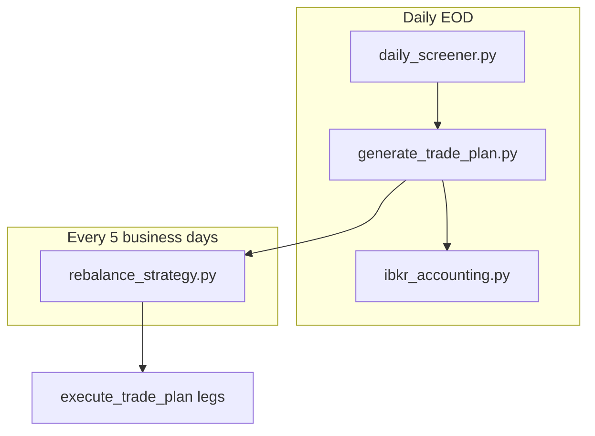

# Bucket 4 cadence + dynamic hedge rollout plan

Branch: **`feat/bucket4-hedge-cadence-engine`** (do not merge until paper-live validation completes).

## What changed (this rollout)

| Knob | Old | New |
|------|-----|-----|
| `hedge_cadence_policy.base_days` | 4 | **10** |
| `hedge_cadence_policy.max_interval` | 10 | **21** |
| Operator script cadence | weekly implicit | **every 5 business days** (`operator_check_days: 5`) |
| Per-pair defer | none | **`bucket4_cadence_gate.py`** + `data/b4_cadence_state.json` |

B1/B2/flow are **unchanged**.

---

## Production architecture (end-to-end)



### 1. Daily screener + trade plan (`generate_trade_plan.py`)

When `bucket4_weekly_opt2.enabled: true`:

1. **Universe** — inverse β<0 names pass B4 gates (`min_net_edge`, `min_underlying_vol`, borrow caps).
2. **Tail-risk weights** — `compute_bucket4_weights` (v6 covariance penalty on pair proxies).
3. **Signals** — per underlying: **TR** (trend ratio), **VCR** (variance-contribution ratio), **VCR_med** (cross-sectional median). Built from underlying prices with **1-day shift** (no look-ahead).
4. **Hedge ratio `h`** (default model: **v6 Opt-2**, not v7):
   - `z_composite` = blend of 10d return rank + range expansion (+ optional regime mult)
   - `h_star = h_base - opt2_k * z_composite`  (default `h_base≈0.55`, `opt2_k=0.05`)
   - EMA smooth: `h = (1-α)*h_prev + α*h_star` (`α=0.25` in panel)
   - Clipped to `[h_min, h_max]` when using v7 path; v6 uses its own bounds
5. **Cadence `interval_days`** (TR/VCR engine):
   - `denom = 1 + k_tr*(TR-1) + m_vcr*(VCR-VCR_med)`
   - `interval = round(base_days / denom)` clipped to `[1, 21]` with **`base_days=10`**
   - Trending (TR>1) → **faster** rebalance; choppy → **slower**
6. **Targets** — `compute_bucket4_targets`:
   - Inverse ETF short USD from weights × budget
   - Underlying short USD = `h × |β| × inverse_short × partial_hedge_ratio` (default **0.75**)
   - **Ratchet** (when enabled): inverse short never **shrinks**; delta cuts flow through underlying leg only
7. **Outputs** — `data/proposed_trades.csv` + `data/runs/<date>/b4_hedge_cadence/b4_hedge_cadence_explain.csv`

Sizing columns in plan: `b4_opt2_hedge_ratio`, `b4_opt2_inverse_etf_short_usd`, underlying `long_usd` (negative = short).

### 2. Rebalance every 5 business days (`rebalance_strategy.py`)

You run the **same** rebalance script on a **5-business-day** calendar (Mon/Wed/Fri or cron). Inside each run:

#### Phase 1 — Cleanup
Close ETFs not in plan (unchanged).

#### Phase 2 — Establish
Open new pairs below `establish_threshold_usd` (unchanged).

#### Phase 2b — Resize (where B4 cadence lives)

**Cadence gate** (`scripts/bucket4_cadence_gate.py`):

For each B4 pair `(ETF, Underlying)`:

| Condition | Action |
|-----------|--------|
| No `last_rebalance` in state | **DUE** (first resize) |
| `trading_days_since(last) >= interval_days` | **DUE** |
| `trading_days_since(last) >= max_interval` (21) | **FORCE DUE** |
| Otherwise | **DEFER** — pair rows removed from resize plan |

Deferred pairs keep positions; plan targets update daily but **no trades** until due.

Telemetry: `data/runs/<date>/rebalance/b4_cadence_decisions.csv`

**Hedge ratio hysteresis** — two layers:

1. **Target level** — `h` moves gradually via EMA in GTP (not re-traded every day).
2. **Execution band** — Phase 2b only trades when leg drift exceeds **12% enter / 4% exit** (`portfolio.rebalance.resize`). Small hedge drift → **no trade** even on a due day.

**Ratchet** — inverse ETF short leg: **BUY-to-cover blocked** in resize; only underlying leg adjusts down.

After successful fills, `data/b4_cadence_state.json` updates `last_rebalance` for traded pairs.

#### Phase 3 — Hedge (B1/B2 only)
Directional net-exposure correction on `core_leveraged` + `yieldboost`. **B4 is not Phase-3 hedged** — its hedge is structural (inverse ETF + partial underlying short).

---

## Hedge ratio: how it is calculated and used

| Layer | What | Where |
|-------|------|-------|
| Dynamic `h` | v6 Opt-2 cross-section score (default) | `bucket4_weekly_opt2.build_hedge_panel_opt2` |
| Scale | `partial_hedge_ratio = 0.75` | `strategy_config.yml` + `compute_bucket4_targets` |
| Structural short | `und_short = h × β × inv_short × 0.75` | `proposed_trades.csv` `long_usd` |
| Accounting | Implied B4 underlying exposure | `ibkr_accounting` `etf_implied` mode |
| Execution deadband | 12% / 4% resize bands | `phase2b_resize.py` |
| Inverse protection | Grow-only ratchet | GTP + `phase2b_resize` |

**Optional v7 hedge** (`hedge_ratio_model: v7`): `h = clip(h_mid + k_vcr*(VCR-VCR_med), 0.30, 0.80)` — only switch after v6 paper-live baseline.

---

## Rollout checklist (staged, on branch)

### Stage 0 — Config only (current commit)
- [x] `base_days: 10`, `max_interval: 21`
- [x] Cadence gate code + tests
- [ ] `bucket4_weekly_opt2.enabled: false` — **leave off** until Stage 1

### Stage 1 — Shadow mode (1–2 weeks)
1. Set `bucket4_weekly_opt2.enabled: true` but **do not** enable ratchet yet.
2. Run daily: `daily_screener` → `generate_trade_plan` → inspect `b4_hedge_cadence_explain.csv`.
3. Run `python -m scripts.bucket4_hedge_cadence --run-date <today> --plots` every 5bd alongside rebalance (read-only).
4. Compare proposed B4 targets vs current holdings; **no B4 resize** (`--skip-phase-2b` or gate with empty state + manual review).

### Stage 2 — Cadence gate live, small resize
1. Enable gate (automatic when `enabled: true` + `source: tr_vcr`).
2. Run full `rebalance_strategy.py` every **5 business days**.
3. Verify `b4_cadence_decisions.csv`: mix of DUE/DEFER; deferred pairs untouched.
4. Enable `ratchet.enabled: true` once inverse inventory is stable.

### Stage 3 — Full production
1. Remove `--skip-phase-2b` shortcuts.
2. Monitor slippage + borrow via accounting runs.
3. Optional: `drawdown_governor` for tail pairs.
4. Open PR to `main` after 4+ successful 5-day cycles.

---

## Optimization plan — Phases 1 & 2 (this branch)

### Phase 1 — Measure (report-only, always on)
* `scripts/bucket4_pair_monitor.py` — per-pair trailing 20/60bd realized PnL,
  annualized return on pair gross, borrow paid vs gross decay captured, and
  `edge_capture_ratio` vs the screener's `bucket4_net_edge_annual`. Emits the
  demotion-ladder flags (half/freeze/exit/vol-floor) WITHOUT acting on them.
  Writes `data/runs/<date>/b4_monitor/b4_pair_monitor.csv` and appends one
  summary line per run to `data/b4_observations.jsonl` (knobs + EW results —
  the raw material for the nudge loop).
* `scripts/bucket4_param_scorecard.py` — replays the real pair backtest over a
  theta-grid around the current `(k_tr, m_vcr, base_days)` and ranks every theta
  on the same fixed metrics (winsorized mean CAGR, median CAGR, vol, max DD).
  Current knobs are marked `is_current`; the script prints HOLD or a one-knob
  nudge suggestion and appends to `data/b4_param_scorecard_history.jsonl`.
  Use `--quick` weekly (7 thetas), full 3x3x3 grid monthly.

### Phase 2 — Cut losers (gated by `pair_lifecycle.enabled`)
* Demotion ladder `normal -> half -> freeze -> exit` in
  `scripts/bucket4_pair_lifecycle.py`; state in `data/b4_pair_lifecycle_state.json`.
  - **half**: edge capture < 0.25 and realized < +10% ann -> 0.5x decay-score weight.
  - **freeze**: trailing 60bd < -15% ann (or vol < keep floor) -> weight 0,
    `purgatory=True` (keep-open, no auto-close).
  - **exit**: trailing 60bd < -30% ann OR material borrow>decay (>= 5% ann drag
    on gross) -> row dropped from plan; Phase 1 cleanup closes it; 45bd re-entry
    cooldown.
  - Escalation is immediate; recovery promotes ONE level per 10 consecutive
    clean monitor runs.
* Underlying-vol floors split into entry/keep: new pairs need >= 0.5 annual vol,
  held pairs (tracked in lifecycle state) may stay down to 0.4 — index-like
  pairs roll off instead of being churned.
* `generate_trade_plan.py` applies the ladder inside the B4 core slice after
  decay-score weights, renormalizing so the budget shifts to surviving pairs.

Rollout: run monitor + lifecycle `--dry-run` daily for ~1 week alongside Stage 1
shadow mode; sanity-check the flagged names; then set `pair_lifecycle.enabled: true`.

---

## Operator commands

```powershell
# Daily (unchanged)
python daily_screener.py
python generate_trade_plan.py
python ibkr_accounting.py

# Every 5 business days
python rebalance_strategy.py --run-date 2026-06-03

# Inspect cadence (human-readable)
python -m scripts.bucket4_hedge_cadence --run-date 2026-06-03 --plots

# Phase 1: monitor + lifecycle shadow (daily, after ibkr_accounting.py)
python -m scripts.bucket4_pair_monitor
python -m scripts.bucket4_pair_lifecycle --dry-run     # drop --dry-run once enabled

# Phase 1: parameter scorecard (weekly quick, monthly full grid)
python -m scripts.bucket4_param_scorecard --quick

# Tests
python -m pytest tests/test_bucket4_hedge_cadence.py tests/test_bucket4_cadence_gate.py tests/test_bucket4_pair_lifecycle.py -q
```

---

## FAQ

**Why run every 5 days if intervals are 1–21?**  
The script is the *polling* interval. Each pair has its own `interval_days`; most runs will trade only the subset that is due. Five days balances ops burden vs catching trending pairs (interval can drop to 1–3d).

**Do we hedge only outside a hysteresis band?**  
Yes — at execution. Plan targets move daily; trades fire only when resize bands breach (12%/4%) **and** cadence says due. `h` itself is smoothed by EMA so targets do not jump daily.

**What if TR/VCR signals are missing?**  
Neutral policy: `h ≈ h_mid (0.55)`, `interval ≈ base_days (10)`.

**Merge policy**  
Stay on `feat/bucket4-hedge-cadence-engine` until Stage 3 sign-off. Do not merge to `main` early.
